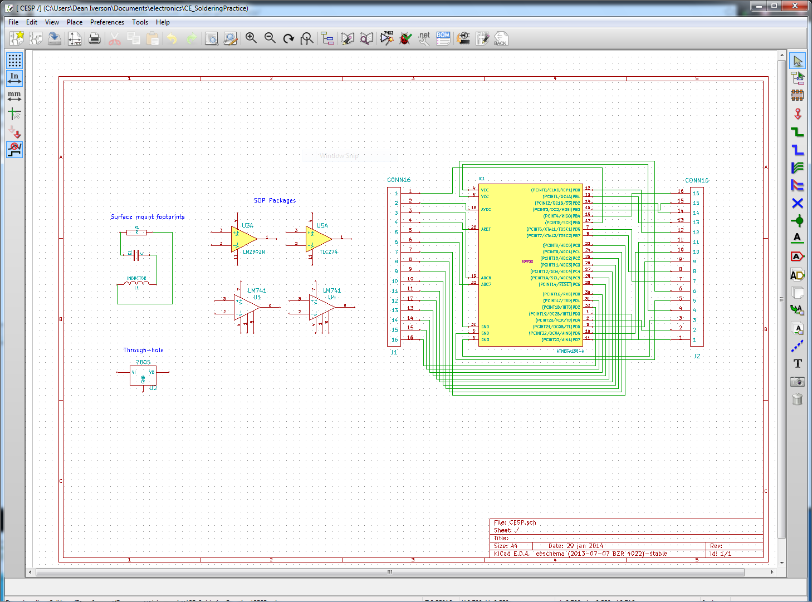
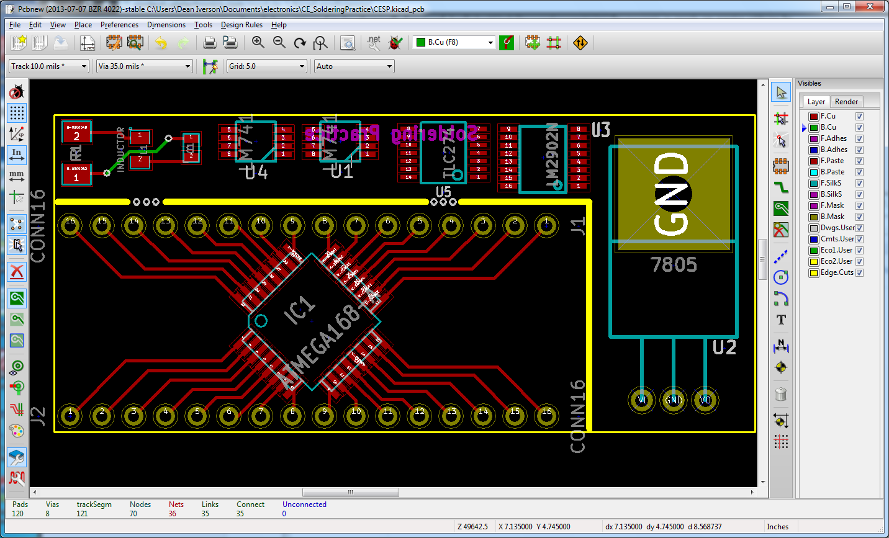
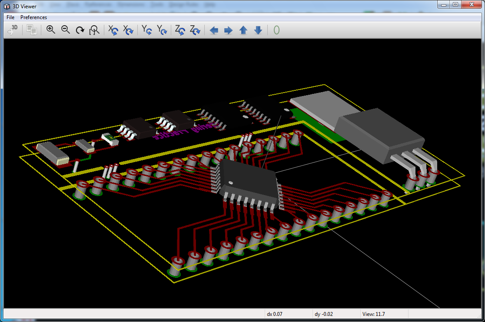

Overview
========

This is a board created to (almost) fulfil the requirements of the Contextual Electronics practice solder board.
I have wanted a board to adapt some 32 pin QFP chips for use on a breadboard for a little while now.  I also wanted
something that I could use to test out a DIY solder reflow oven if I ever get around to that project.  This board
is an attempt to do both while at the same time meeting the requirements of the CE solder practice board.

One interesting thing I learned is that you cannot submit an empty back silk screen layer to OSHpark.  I would assume
that you could just remove that layer from your gerbers, but I didn't try.  I opted to just put some text on the back
instead.  I should have put an image on!

Screen Shots
============

